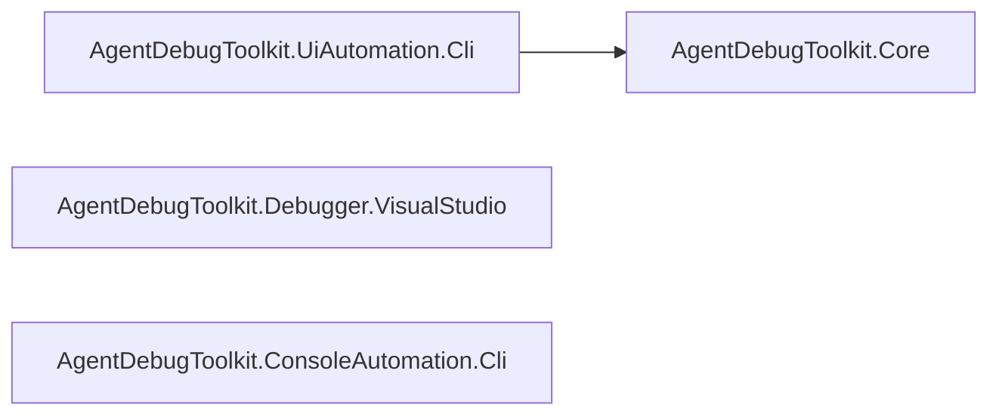

# Code Summary

AgentDebugToolkit is a Windows-only .NET 8 toolkit with independent UI Automation, Visual Studio
debugger, and ConPTY console CLI components. It executes live operations while the calling agent
owns navigation maps and workflow reasoning.

## Dependency Graph

## Symbol Index

### AgentDebugToolkit.Core

| Symbol | File | Responsibility |
|---|---|---|
| `JsonOutput` | `JsonOutput.cs` | Writes the shared success/error JSON envelope to stdout (see `docs/CLI_CONTRACT.md`) |
| `Selector` / `SelectorStrategy` | `Models/Selector.cs` | Describes how to locate a UI element (Name, AutomationId; NameRegex/ControlTypeIndex/Coordinates reserved for later phases) |
| `WindowInfo`, `ElementInfo`, `Rect` | `Models/WindowAndElementInfo.cs` | DTOs returned to the CLI caller describing windows/elements/bounding rects |

### AgentDebugToolkit.UiAutomation.Cli

| Symbol | File | Responsibility |
|---|---|---|
| `Program` / `Verbs` (top-level) | `Program.cs` | Entry point; parses `--key value` args and dispatches UI Automation verbs |
| `UiaHelper` | `UiaHelper.cs` | Wraps `System.Windows.Automation` calls: enumerate windows, resolve selectors, build `ElementInfo` trees, perform click/type (pattern-based, falling back to synthetic input), and `SendKeys` (click-to-focus + raw `SendKeys.SendWait`, Phase 9) |
| `SessionContext` | `SessionContext.cs` | Persists the "current" pid to a temp JSON file so subsequent CLI invocations (separate processes) can omit `--pid` after `attach` |
| `ScreenshotHelper` | `ScreenshotHelper.cs` | Captures a PNG screenshot of an element's bounding rect to local app data |
| `NativeMethods` | `NativeMethods.cs` | P/Invoke user32 helpers for synthetic mouse/keyboard input and window queries; primary interaction mechanism since target apps often support no UIA patterns. Also wraps `SetForegroundWindow` (`activate`, Phase 9) and raw `SendKeys.SendWait` (`SendKeysRaw`, Phase 9) |

### AgentDebugToolkit.Debugger.VisualStudio

| Symbol | File | Responsibility |
|---|---|---|
| `Program` | `Program.cs` | EnvDTE debugger verb dispatch and JSON results |
| `DteLocator` / `ComRetry` | `DteLocator.cs`, `ComRetry.cs` | Finds a Visual Studio ROT instance and retries transient COM-busy calls |

### AgentDebugToolkit.ConsoleAutomation.Cli

| Symbol | File | Responsibility |
|---|---|---|
| `Program` / `ConsoleVerbs` | `Program.cs`, `ConsoleVerbs.cs` | Public launch, terminal, wait, status, and stop verb dispatch |
| `BrokerProgram` / `NativeConPty` | `BrokerProgram.cs`, `NativeConPty.cs` | Detached ConPTY broker, target lifecycle, pipe protocol, and Win32 interop |
| `TerminalBuffer` / `BrokerClient` | `TerminalBuffer.cs`, `BrokerClient.cs` | VT output buffer and named-pipe client transport |
| `ConsoleSessionContext` / `CommandLine` | `ConsoleSessionContext.cs`, `CommandLine.cs` | Persisted broker session validation and option parsing |

See `docs/KEY_FLOWS.md` for traced end-to-end call flows.

## Other docs in this repo

`docs/ARCHITECTURE.md`, `docs/CLI_CONTRACT.md`, `docs/IMPLEMENTATION_PLAN.md`,
`docs/NAVIGATION_MAP_SCHEMA.md`, `docs/VALIDATION_FINDINGS.md` — pre-existing design/reference
docs, not owned by this memory-management skill.
