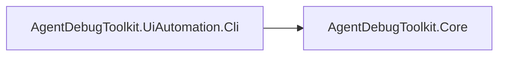

# Code Summary

AgentDebugToolkit is a Windows-only .NET 8 CLI tool for driving/inspecting desktop app UI via
UI Automation (UIA) — attach to a process, list/inspect windows, click/type/get-text on
elements, resolved via selectors (Name/AutomationId today; NameRegex/ControlTypeIndex/
Coordinates planned). It's currently in an early "Phase 1" state (see `docs/ARCHITECTURE.md`,
`docs/IMPLEMENTATION_PLAN.md`).

## Dependency Graph

## Symbol Index

### AgentDebugToolkit.Core

| Symbol | File | Responsibility |
|---|---|---|
| `JsonOutput` | `JsonOutput.cs` | Writes the shared success/error JSON envelope to stdout (see `docs/CLI_CONTRACT.md`) |
| `Selector` / `SelectorStrategy` | `Models/Selector.cs` | Describes how to locate a UI element (Name, AutomationId; NameRegex/ControlTypeIndex/Coordinates reserved for later phases) |
| `WindowInfo`, `ElementInfo`, `Rect` | `Models/WindowAndElementInfo.cs` | DTOs returned to the CLI caller describing windows/elements/bounding rects |

### AgentDebugToolkit.UiAutomation.Cli

| Symbol | File | Responsibility |
|---|---|---|
| `Program` / `Verbs` (top-level) | `Program.cs` | Entry point; parses `--key value` args, dispatches verbs: `attach`, `list-windows`, `inspect`, `click`, `type`, `get-text` |
| `UiaHelper` | `UiaHelper.cs` | Wraps `System.Windows.Automation` calls: enumerate windows, resolve selectors, build `ElementInfo` trees, perform click/type (pattern-based, falling back to synthetic input) |
| `SessionContext` | `SessionContext.cs` | Persists the "current" pid to a temp JSON file so subsequent CLI invocations (separate processes) can omit `--pid` after `attach` |
| `ScreenshotHelper` | `ScreenshotHelper.cs` | Captures a PNG screenshot of an element's bounding rect to local app data |
| `NativeMethods` | `NativeMethods.cs` | P/Invoke user32 helpers for synthetic mouse/keyboard input and window queries; primary interaction mechanism since target apps often support no UIA patterns |

See `docs/KEY_FLOWS.md` for traced end-to-end call flows.

## Other docs in this repo

`docs/ARCHITECTURE.md`, `docs/CLI_CONTRACT.md`, `docs/IMPLEMENTATION_PLAN.md`,
`docs/NAVIGATION_MAP_SCHEMA.md`, `docs/VALIDATION_FINDINGS.md` — pre-existing design/reference
docs, not owned by this memory-management skill.
